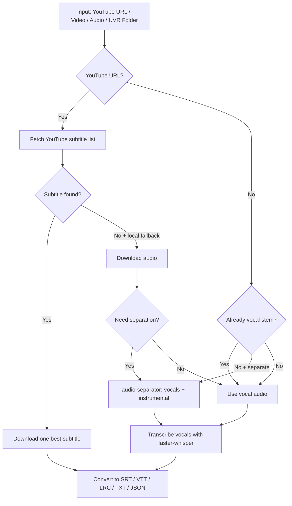

# Audio Workflow Skills

Codex skills and CLI helpers for practical audio workflows:

- `youtube-mp3`: download YouTube videos as MP3 with `yt-dlp` and `ffmpeg`.
- `audio-subtitles`: generate timestamped lyrics/subtitles from audio, video, YouTube URLs, UVR vocal stems, or optional UVR-style source separation.

## How It Works

The default path avoids local transcription when YouTube already has usable captions:



More detail: [docs/flow.md](docs/flow.md)

Desktop app product notes: [docs/desktop-app-prd.md](docs/desktop-app-prd.md)

## Install

```bash
git clone https://github.com/gottaegbert/audio-workflow-skills.git
cd audio-workflow-skills
./install.sh
```

The installer copies skills into `${CODEX_HOME:-$HOME/.codex}/skills` and creates command wrappers in `$HOME/.local/bin`.

Install runtime dependencies:

```bash
# macOS
HOMEBREW_NO_AUTO_UPDATE=1 brew install ffmpeg yt-dlp

# local transcription engine
setup-audio-subtitles

# optional UVR-style separation engine
setup-audio-separator
```

`setup-audio-separator` installs PyTorch and related separation packages, so it is much larger than the transcription-only setup. Skip it unless you need `audio-subtitles --separate`.

## YouTube to MP3

```bash
youtube-mp3 "https://www.youtube.com/watch?v=..."
youtube-mp3 --browser chrome "https://www.youtube.com/watch?v=..."
```

Default output:

```text
~/Downloads/YouTube MP3
```

## Audio/Video to Lyrics and Subtitles

```bash
audio-subtitles "/path/to/song.mp3"
audio-subtitles "/path/to/video.mp4"
audio-subtitles "https://www.youtube.com/watch?v=..."
```

For YouTube URLs, the default is to use YouTube subtitles or auto-subtitles first. Local Whisper only runs for URLs when you ask for it:

```bash
audio-subtitles --subtitle-source local "https://www.youtube.com/watch?v=..."
audio-subtitles --local-fallback "https://www.youtube.com/watch?v=..."
```

Useful subtitle controls:

```bash
audio-subtitles --sub-langs "zh.*,en.*" "https://www.youtube.com/watch?v=..."
audio-subtitles --keep-platform-subs "https://www.youtube.com/watch?v=..."
```

The command resolves subtitle language selectors to one best matching subtitle before downloading, so it avoids the common `--sub-langs all` behavior of downloading hundreds of translated tracks.

Default outputs:

- `.lrc` for synced lyrics.
- `.srt` for subtitles/video editors.
- `.vtt` for web playback.
- `.txt` for quick review.
- `.json` for downstream processing.

## UVR / Source Separation Flow

If you already used Ultimate Vocal Remover GUI, pass the exported folder or vocal stem:

```bash
audio-subtitles "/path/to/uvr-output-folder"
audio-subtitles "/path/to/vocals.wav"
```

For an end-to-end CLI flow, install `audio-separator` support and run:

```bash
setup-audio-separator
audio-subtitles --separate "/path/to/song.mp3"
audio-subtitles --separate "https://www.youtube.com/watch?v=..."
```

This keeps separated stems in `stems/`, transcribes the vocal stem, and leaves the instrumental/backing stem available for DAWs or music software.

## Model Notes

`audio-subtitles` uses `faster-whisper` by default. Good defaults:

- `--model small`: fast draft.
- `--model medium`: recommended default.
- `--model large-v3-turbo`: better quality when time/memory allows.
- `--model large-v3`: heaviest local Whisper-family option.

Song transcription is harder than speech transcription. Clean vocal stems improve results more than simply choosing a larger model.

## Legal and Account Notes

Only download or process media you have the right to use. Browser cookies are login credentials; keep them private and do not commit or share them.

## Upstream Tools

- [yt-dlp](https://github.com/yt-dlp/yt-dlp)
- [faster-whisper](https://github.com/SYSTRAN/faster-whisper)
- [audio-separator](https://pypi.org/project/audio-separator/)
- [Ultimate Vocal Remover GUI](https://github.com/Anjok07/ultimatevocalremovergui)
