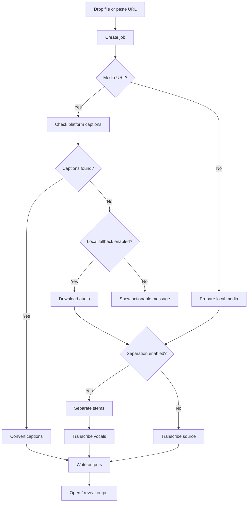
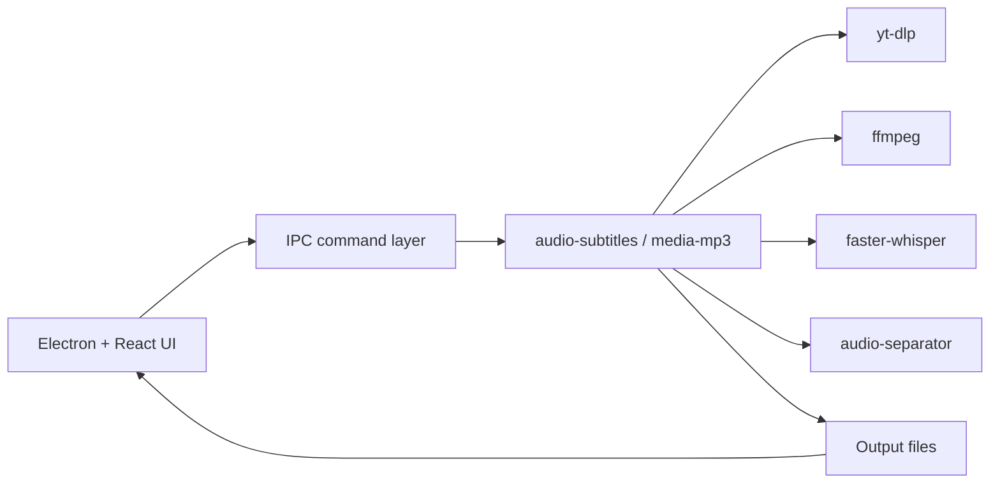

# Desktop App PRD

## Product Intent

Create a desktop app that turns media links such as YouTube/Bilibili, video files, audio files, or UVR stems into practical singing and subtitle assets without requiring CLI knowledge.

Primary output:

- Synced lyrics for singing practice.
- Subtitle files for video workflows.
- Optional instrumental/vocal stems for DAWs.

The CLI remains the source of truth. The desktop app should orchestrate existing commands instead of reimplementing media processing.

## Target Users

- Designers, creators, musicians, and karaoke users who are comfortable dragging files but not comfortable debugging CLI tools.
- Video editors who need quick `.srt` / `.vtt` files.
- Singers who want `.lrc` lyrics and an instrumental backing track.
- Technical users who still want CLI parity and reproducible output.

## MVP Scope

### Inputs

- YouTube/Bilibili/media URL.
- Local video file.
- Local audio file.
- UVR output folder.

### Core Actions

- Detect input type.
- Prefer platform captions for media URLs when available.
- Fall back to local transcription by default for Bilibili URLs without platform subtitles.
- Fall back to local transcription only when selected.
- Optional vocal separation.
- Show job progress and logs.
- Open output folder.

### Outputs

- `.lrc`
- `.srt`
- `.vtt`
- `.txt`
- `.json`
- Optional `stems/` folder with vocals and instrumental.

## Non-Goals for MVP

- No full DAW integration.
- No cloud processing.
- No account system.
- No built-in media-site browser.
- No destructive editing of source media.
- No advanced lyric editor in the first release.

## First Screen

The first screen should be the working surface, not a marketing landing page.

Recommended layout:

```text
+--------------------------------------------------------------+
| VocalFlow Studio                                             |
| [URL input or file drop target] [Run]                         |
+----------------------+---------------------------------------+
| Queue                | Job Detail                             |
| - Song A             | Input                                  |
| - Song B             | Subtitle source: Platform / Local      |
| - Song C             | Separation: Off / On                   |
|                      | Model: medium                          |
|                      | Output formats: LRC SRT VTT TXT JSON   |
|                      | [Open output folder] [Reveal logs]     |
+----------------------+---------------------------------------+
```

## User Flow



## Settings

### Subtitle Source

- Auto: platform captions first; Bilibili defaults to local fallback when needed.
- Platform only.
- Local Whisper.

### Language

- Auto.
- Preferred language selector, e.g. `en`, `zh.*`, `ja`.

### Local Model

- `small`
- `medium`
- `large-v3-turbo`
- `large-v3`

### Separation

- Off by default.
- On for vocal/instrumental package.
- Advanced model selector hidden behind an advanced section.

### Output

- Output folder.
- Keep raw platform VTT.
- Keep extracted audio.
- Keep stems.

## Technical Architecture

Recommended stack:

- Electron for desktop shell.
- React for UI.
- A small Node process wrapper around CLI commands.
- Existing CLI scripts as the stable processing layer.



### Why Keep CLI as Core

- CLI users and app users share one implementation.
- Easier debugging.
- Easier automation.
- Safer upgrades for `yt-dlp`, `ffmpeg`, Whisper, and separation tooling.

## Job State Model

Suggested states:

- `queued`
- `reading_metadata`
- `downloading_subtitles`
- `downloading_audio`
- `separating`
- `transcribing`
- `writing_outputs`
- `complete`
- `failed`

Each job should store:

- input URL/path
- resolved media title
- selected subtitle source
- selected language
- output directory
- generated files
- raw logs
- failure reason

## Error Copy

Errors should be specific and action-oriented:

- Media site asked for sign-in: ask user to retry with browser cookies.
- No captions found: offer local fallback.
- Local model missing: offer setup command.
- Separation dependency missing: offer setup command and warn about size.
- Rate limited: tell user the app downloads one subtitle by default and suggest retrying later or changing language.

## Design Direction

The app should feel like a focused production tool:

- Quiet, dense, and practical.
- Clear queue and status feedback.
- No large marketing hero.
- No decorative visual noise.
- High confidence around where files are saved.
- Logs available but not front-and-center.

## Later Features

- Timeline lyric editor.
- Manual cue splitting and merge.
- One-click karaoke package export.
- Batch jobs.
- Presets for video editor, karaoke, and DAW use.
- Watch folder.
- App-level model cache manager.
- Optional waveform preview.
