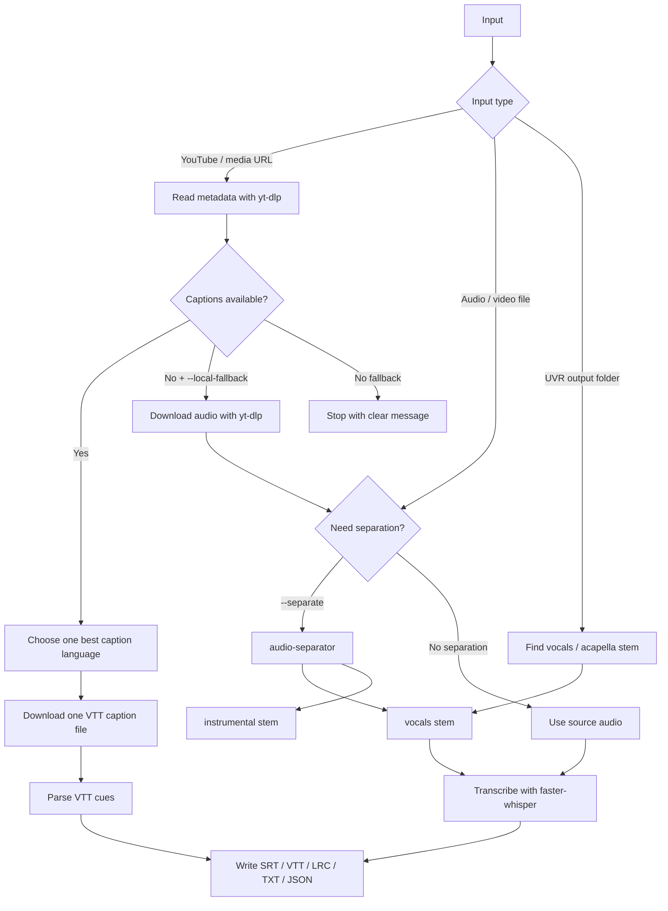

# Audio Workflow Flow

This project is built around one rule: use the cheapest reliable source first. For YouTube URLs, that means platform subtitles before local transcription. For local media, that means clean vocal stems before mixed audio.

## High-Level Flow



## YouTube Subtitle-First Path

Default command:

```bash
audio-subtitles "https://www.youtube.com/watch?v=..."
```

Behavior:

- Read video metadata with `yt-dlp --dump-single-json`.
- Inspect `subtitles` and `automatic_captions`.
- Resolve `--language` or `--sub-langs` to one best matching language.
- Download exactly one VTT subtitle file.
- Convert it to `.srt`, `.vtt`, `.lrc`, `.txt`, and `.json`.

This avoids the expensive and rate-limit-prone behavior of downloading every translated subtitle track.

Useful controls:

```bash
audio-subtitles --language en "https://www.youtube.com/watch?v=..."
audio-subtitles --sub-langs "zh.*,en.*" "https://www.youtube.com/watch?v=..."
audio-subtitles --keep-platform-subs "https://www.youtube.com/watch?v=..."
```

Force local transcription:

```bash
audio-subtitles --subtitle-source local "https://www.youtube.com/watch?v=..."
audio-subtitles --force-local "https://www.youtube.com/watch?v=..."
```

Try captions first, then local transcription if no caption exists:

```bash
audio-subtitles --local-fallback "https://www.youtube.com/watch?v=..."
```

## Local Media Path

```bash
audio-subtitles "/path/to/song.mp3"
audio-subtitles "/path/to/video.mp4"
```

Behavior:

- Extract 16 kHz mono WAV with `ffmpeg`.
- Transcribe locally with `faster-whisper`.
- Use word timestamps when available.
- Write all output formats.

Local transcription runs on the user's machine. It does not consume LLM chat tokens, but it does use CPU/GPU, disk, and model cache space.

## UVR / Vocal Separation Path

If the user already has stems from Ultimate Vocal Remover GUI:

```bash
audio-subtitles "/path/to/uvr-output-folder"
audio-subtitles "/path/to/vocals.wav"
```

If the user wants the CLI to separate first:

```bash
audio-subtitles --separate "/path/to/song.mp3"
audio-subtitles --separate "https://www.youtube.com/watch?v=..."
```

Behavior:

- `audio-separator` creates vocals and instrumental stems.
- The vocal stem is transcribed.
- The instrumental stem remains available for DAWs, karaoke, or singing practice.

## Output Package

Default outputs:

- `.lrc`: synced lyrics.
- `.srt`: subtitle editors and video tools.
- `.vtt`: web playback.
- `.txt`: review-friendly timed text.
- `.json`: machine-readable cues for later tools.

Future app packaging should group these into one folder:

```text
Song Name/
  lyrics.lrc
  subtitles.srt
  subtitles.vtt
  transcript.txt
  cues.json
  stems/
    vocals.wav
    instrumental.wav
```

## Token and Compute Model

Most work is local automation:

- `yt-dlp`: downloads metadata, captions, or audio.
- `ffmpeg`: converts media.
- `audio-separator`: optional source separation.
- `faster-whisper`: local transcription.

This does not consume LLM chat tokens. Tokens are only involved when an assistant is asked to reason about the workflow, edit code, clean lyrics, summarize output, or debug errors.
